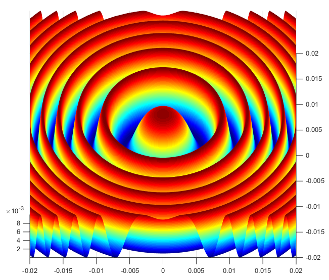
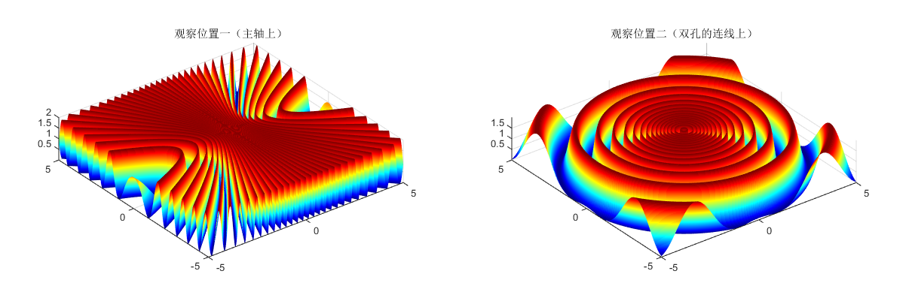
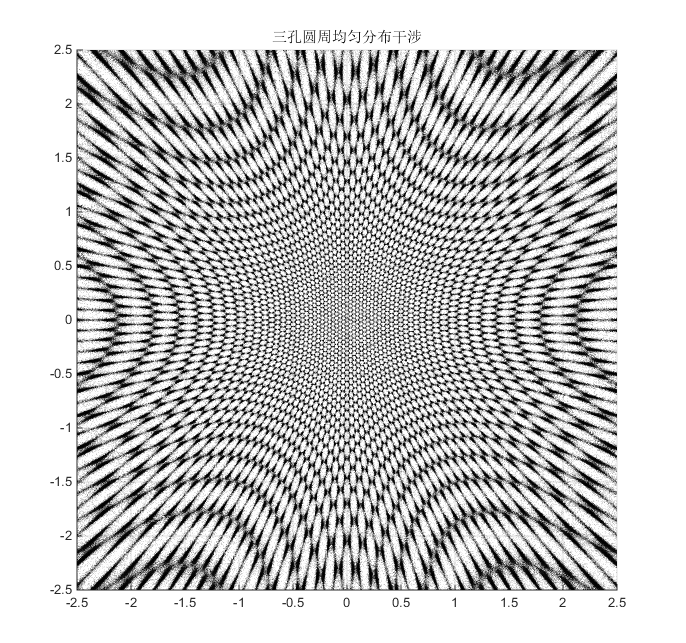
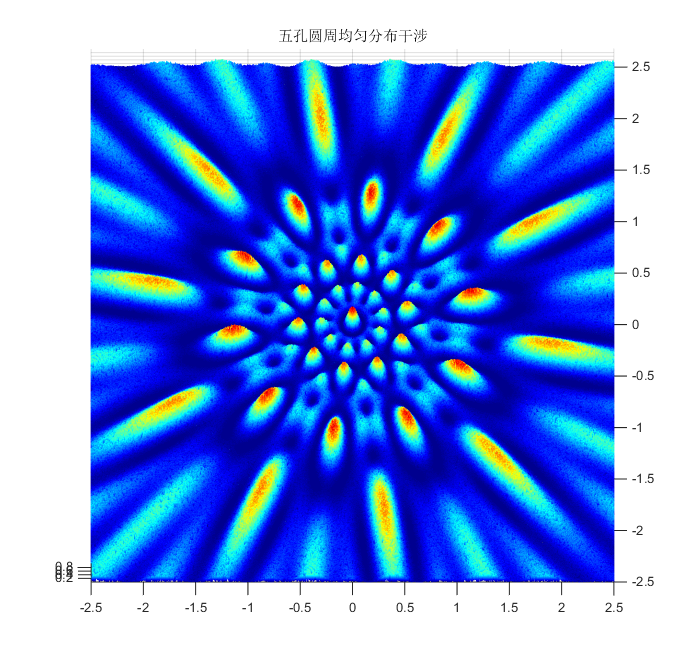
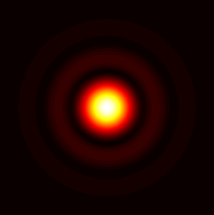
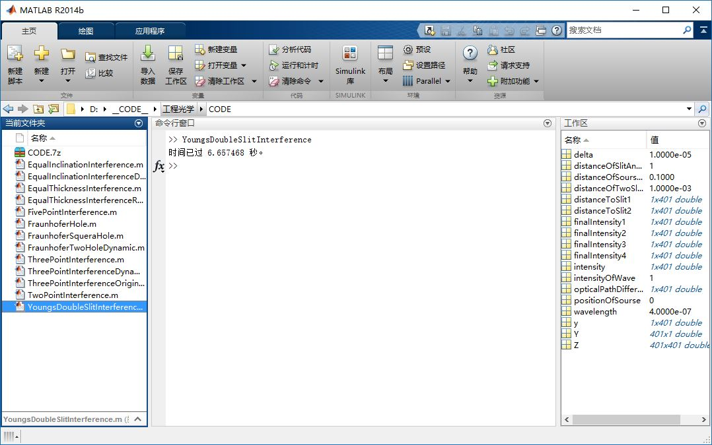
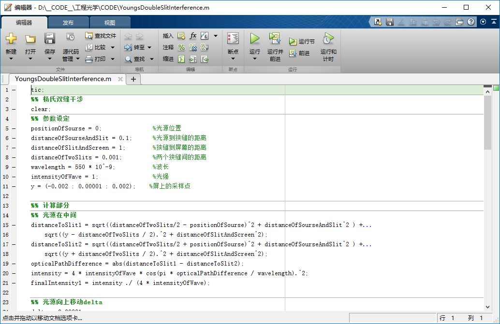

# 工程光学仿真 之 MATLAB基础使用讲解
----
**陈霁阳	chenjiyang@buaa.edu.cn**

## 0 目标展示















## 1 MATLAB界面介绍

以下是MATLAB常见的和常用的用户界面，MATLAB版本2014b，其他版本会有所不同

###### 主界面



###### 编辑器界面

+ 工作路径文件
+ 命令窗口
+ 工作区
+ 历史（history）（很少用所以我一般关掉了）



###### 查看变量的界面（查BUG）


###### 图形显示界面（主要用于仿真结果显示）


## 2 MATLAB语言简介

### 定性

MATLAB是一种 **高级语言**，是 **过程语言** 和解释性语言

#### 高级语言

+ 变量类型以及内存系统自动分配
+ 相较C语言没有过分严格的语法规定
+ 软件提供各种自带功能函数供直接调用，这也是工程计算常用MATLAB的原因之一

#### 过程语言

类似C语言，可以写一个主函数，按照编辑的顺序从前往后运行，期间可以调用自定义函数，自定义函数可以写在其他的文件里面

## 3 MATLAB 编程语言详细介绍 *针对光学仿真部分*

### 3.1 查找帮助文档

一定要学会自己查看自带的帮助文档！！

exp: help指令
``` matlab
help plot
```
运行结果


参考页详细文件


### 3.2 变量

#### 关于变量声明

在MATLAB中变量可以不用声明直接使用，但是系统会发出运行效率低的提示，所以一般是先声明（分配内存）再使用。

#### 关于变量命名方式

建议采用有实际意义的命名，这样在变量使用很多的时候区分各个变量的意义，而且不需要再注释。

exp：

``` matlab
positionOfSourse = 0;               % 光源位置
distanceOfSourseAndSlit = 0.1;      % 光源到狭缝的距离
distanceOfSlitAndScreen = 1;        % 狭缝到屏幕的距离
distanceOfTwoSlits = 0.001;         % 两个狭缝间的距离
wavelength = 550 * 10^-9;           % 波长
intensityOfWave = 1;                % 光强
y = (-0.002 : 0.00001 : 0.002);     % 屏上的采样点
```

#### 常用变量的不同类型及声明

**重要：MATLAB是以矩阵的形式储存数据的（结构体和细胞结构*cell*内部其实也是矩阵）**

##### 一维矩阵 *向量*或者*数组*

exp：

``` matlab
data1 = 1;

data2 = 1:20;

data3 = 1:0.05:20;				% 常用，因为很简洁

data4 = linspace(1,20,10);		% linspace函数：y = linspace(x1,x2,N)

one = ones(1,n);				% 全1

zero = zeros(1,n);				% 全0

% 注意区分声明后面加与不加分号 ; 的不同
data5 = 1:0.01:10;
data6 = 1:0.01:10
% 取消回显，可以明显提升代码运行速度
```

##### 二维矩阵

``` matlab
one = ones(n,n);

zero = zeros(n,n);
```
exp：另外实验中常用*meshgrid*函数进行声明

help meshgrid 的结果
>meshgrid - Rectangular grid in 2-D and 3-D space  
>    This MATLAB function replicates the grid vectors xgv and ygv to produce a full grid.  
>    [X,Y] = meshgrid(xgv,ygv)  
>    [X,Y,Z] = meshgrid(xgv,ygv,zgv)  
>    [X,Y] = meshgrid(gv)  
>    [X,Y,Z] = meshgrid(gv)  

``` matlab
delta = 0.0000001;			%防止矩阵中有0这个元素而做除数结果异常
[X1,Y1] = meshgrid(-0.1+delta : 0.001 : 0.1+delta ,-0.1+delta : 0.001 : 0.1+delta );
```

这样声明的结果：


这是进行仿真计算显示屏上的图像的时候需要用到的变量类型。

#### 常用的变量运算

**注意： 矩阵运算和矩阵中元素运算的区别**

##### 元素运算

+ 加法 **+** 或 **.+**
+ 减法 **-** 或 **.-**
+ 乘法 **.***
+ 除法 **./**
+ 指数 **.^**
+ 自然对数	log()
+ 10为底对数	log10()

##### 矩阵运算（优点：精通时可以大大简化程序和加快速度）

+ 加法 **+**
+ 减法 **-**
+ 乘法 \*
+ 除法 **/**
+ 取逆 ^(-1) 或者 inv()
+ 转置 **'** 或者 rand()

#### 元素提取

exp：
``` matlab
data = [1:10]' * [1:10];		% 声明一个10*10矩阵方便演示
row = data(1,:)					% 取data第1行
col = data(:,1)					% 取data第1列
row2 = data(1,3:6)				% 取data第1行第3个元素到第6个元素
a = data(5,5)					% 取data中一个元素
```

**注意：序号从1开始，和C语言不同**

### 3.3 常用结构

#### 判断结构

exp:

``` matlab
if a > b
	a = c;
end
```

**注意：判断相等是 == ，和C语言相同**

#### 循环结构（少用）

exp:

``` matlab
a = 0;
for i = 1:1:10
	a = a + 1;
end
```

#### 代码节

用双注释符加空格表示节分隔符，在调试程序时可以只运行单独的节

## 4 仿真实例讲解以及仿真常用函数

### 实例 1 —— 杨氏双缝干涉

***MATLAB code***

#### 变量声明

``` matlab
tic;
%% 杨氏双缝干涉
clear;
%% 参数设定
positionOfSourse = 0;               %光源位置
distanceOfSourseAndSlit = 0.1;      %光源到狭缝的距离
distanceOfSlitAndScreen = 1;        %狭缝到屏幕的距离
distanceOfTwoSlits = 0.001;         %两个狭缝间的距离
wavelength = 550 * 10^-9;           %波长
intensityOfWave = 1;                %光强
y = (-0.002 : 0.00001 : 0.002);     %屏上的采样点
```

#### 计算部分

主要用到公式：
$$ d_1 = \sqrt{ x_1 ^ 2 + y_1 ^ 2 }$$
$$ d_2 = \sqrt{ x_2 ^ 2 + y_2 ^ 2 }$$
$$ \Delta d = | d_1 - d_2 |$$
$$I = 4I_0\cos ^2 (\frac{\pi \Delta d}{\lambda})$$

``` matlab
%% 计算部分
%% 光源在中间
distanceToSlit1 = sqrt((distanceOfTwoSlits/2 - positionOfSourse)^2 + distanceOfSourseAndSlit^2 ) +...
    sqrt((y - distanceOfTwoSlits / 2).^2 + distanceOfSlitAndScreen^2);
distanceToSlit2 = sqrt((distanceOfTwoSlits/2 + positionOfSourse)^2 + distanceOfSourseAndSlit^2 ) +...
    sqrt((y + distanceOfTwoSlits / 2).^2 + distanceOfSlitAndScreen^2);
opticalPathDifference = abs(distanceToSlit1 - distanceToSlit2);
intensity = 4 * intensityOfWave * cos(pi * opticalPathDifference / wavelength).^2;
finalIntensity1 = intensity ./ (4 * intensityOfWave);

%% 光源向上移动delta
delta = 0.00001;
positionOfSourse = positionOfSourse + delta;
distanceToSlit1 = sqrt((distanceOfTwoSlits/2 - positionOfSourse)^2 + distanceOfSourseAndSlit^2 ) +...
    sqrt((y - distanceOfTwoSlits / 2).^2 + distanceOfSlitAndScreen^2);
distanceToSlit2 = sqrt((distanceOfTwoSlits/2 + positionOfSourse)^2 + distanceOfSourseAndSlit^2 ) +...
    sqrt((y + distanceOfTwoSlits / 2).^2 + distanceOfSlitAndScreen^2);
opticalPathDifference = abs(distanceToSlit1 - distanceToSlit2);
intensity = 4 * intensityOfWave * cos(pi * opticalPathDifference / wavelength).^2;
finalIntensity2 = intensity ./ (4 * intensityOfWave);

%% 狭缝变窄distanceOfTwoSlits = 0.0005（光源仍在中心位置）
positionOfSourse = 0;
distanceOfTwoSlits = 0.0005;
distanceToSlit1 = sqrt((distanceOfTwoSlits/2 - positionOfSourse)^2 + distanceOfSourseAndSlit^2 ) +...
    sqrt((y - distanceOfTwoSlits / 2).^2 + distanceOfSlitAndScreen^2);
distanceToSlit2 = sqrt((distanceOfTwoSlits/2 + positionOfSourse)^2 + distanceOfSourseAndSlit^2 ) +...
    sqrt((y + distanceOfTwoSlits / 2).^2 + distanceOfSlitAndScreen^2);
opticalPathDifference = abs(distanceToSlit1 - distanceToSlit2);
intensity = 4 * intensityOfWave * cos(pi * opticalPathDifference / wavelength).^2;
finalIntensity3 = intensity ./ (4 * intensityOfWave);

%% 波长变小
distanceOfTwoSlits = 0.001;
wavelength = 400 * 10^-9;
distanceToSlit1 = sqrt((distanceOfTwoSlits/2 - positionOfSourse)^2 + distanceOfSourseAndSlit^2 ) +...
    sqrt((y - distanceOfTwoSlits / 2).^2 + distanceOfSlitAndScreen^2);
distanceToSlit2 = sqrt((distanceOfTwoSlits/2 + positionOfSourse)^2 + distanceOfSourseAndSlit^2 ) +...
    sqrt((y + distanceOfTwoSlits / 2).^2 + distanceOfSlitAndScreen^2);
opticalPathDifference = abs(distanceToSlit1 - distanceToSlit2);
intensity = 4 * intensityOfWave * cos(pi * opticalPathDifference / wavelength).^2;
finalIntensity4 = intensity ./ (4 * intensityOfWave);
```

#### 绘图部分

**主要用到函数**

##### **plot()**

绘制二维函数图像
常用参数：

+ title()				图像标题
+ xlabel(), ylabel()	坐标轴名称
+ legend()				注脚
+ axis equal			使坐标轴比例尺相同
+ grid on				显示坐标网线

##### **subplot()**

在同一窗口绘制多幅图
exp: *subplot(2,2)* 为绘制2$\times$2分布的图像

##### **plot3()**

在三维空间中画线，仿真中使用比较少

##### **surf()** 和 **mesh()**

可在三维空间中绘制曲面，大量使用。
*surf()*为绘制面，*mesh()*为绘制网格，个人认为*surf()*在这次试验中效果更好。
常用参数：

+ title()						图像标题
+ xlabel(), ylabel(), zlabel()	坐标轴名称
+ legend()						注脚
+ axis equal					使坐标轴比例尺相同
+ grid on						显示坐标网线
+ shading interp				使曲面平滑过渡，并隐藏网格，常用
+ colormap()					配色方案
+ view()						初始观察视角

``` matlab
%% 绘图部分
%% 一维
subplot(2,2,1);
plot(y,finalIntensity1,'k');
title('光源上移');xlabel('屏上位置');ylabel('光强');
hold on;
plot(y,finalIntensity2,'b');
legend('原始光线','光源上移后');

subplot(2,2,2);
plot(y,finalIntensity1,'k');
title('狭缝变窄');xlabel('屏上位置');ylabel('光强');
hold on;
plot(y,finalIntensity3,'r');
legend('原始光线','狭缝变窄后');

subplot(2,2,3);
plot(y,finalIntensity1,'k');
title('波长变小');xlabel('屏上位置');ylabel('光强');
hold on;
plot(y,finalIntensity4,'g');
legend('原始光线','波长变小后');

%% 二维
Y = ones(length(y) , 1);
Z = Y * finalIntensity1;
subplot(2,2,4);
surf(y,y,Z);
view(2);
shading interp;
colormap(gray);
title('原始光线干涉在屏上的空间分布(可变换视角)');xlabel('屏上x');ylabel('屏上y');zlabel('强度');

toc;
```
*注：代码开头和结尾的**tic toc**可以在运行完毕后显示运行耗时*

**运行结果**


### 实例 2 —— 夫琅禾费方孔衍射

**简略代码，直接套用主要公式**
$$I = |\widetilde{E}|^2 = I_0\left( \frac{\sin \frac{kla}{2}}{\frac{kla}{2}}\right) ^2\left( \frac{\sin \frac{k \omega b}{2}}{\frac{k\omega b}{2}}\right) ^2$$

***MATLAB code***
``` matlab
clear;
delta = 0.0000001;
[X1,Y1] = meshgrid(-0.005+delta : 0.0001 : 0.005+delta ,-0.005+delta : 0.0001 : 0.005+delta );
II = (sin(pi*0.005*sin(atan(X1./10))/550e-9)./(pi*0.005*sin(atan(X1./10))/550e-9)).^2.*...
    (sin(pi*0.005*sin(atan(Y1./10))/550e-9)./(pi*0.005*sin(atan(Y1./10))/550e-9)).^2;
surf(X1,Y1,II.^0.70./100);
view(45,45);
colormap(jet);
axis equal;
axis off;
shading interp;
figure
surf(X1,Y1,II.^0.7./100);		% 为了直观显示，对强度进行了伽马调制
colormap(hot);
view(0,90);
axis equal;
axis off;
shading interp;
```

**运行结果**


<br />
<br />
<br />
<br />
<br />
<br />
<br />

### 问题：很多情况下没有公式，比如五个孔的夫琅禾费衍射，该如何仿真？

<br />
<br />
**提示：两相干单色光波在P点的叠加公式为：**
$$\color{red}{\widetilde{\bf{E}} (P) = \widetilde{\bf{E}} _1 (P) + \widetilde{\bf{E}} _2 (P)}$$

即:
$$\color{red}{A e^{i\alpha} = a_1 e^{i\alpha _1} + a_2 e^{i\alpha _2}}$$

***多条相干光束呢？对于平面光波呢？***

<br />
<br />
<br />
<br />
<br />
<br />
<br />
<br />

结语：MATLAB是我们新接触的一门强大的用于科学计算的语言，代码里面也蕴含着很多特殊技巧，同学们可以以光学仿真作业为契机，巩固工光知识的同时，花时间钻研一下这门语言，应该是很有乐趣的。希望大家最终做得要比我们这一届出色！
-------------------------------------


**陈霁阳		chenjiyang@buaa.edu.cn**

**2016 年 10 月 13 日**